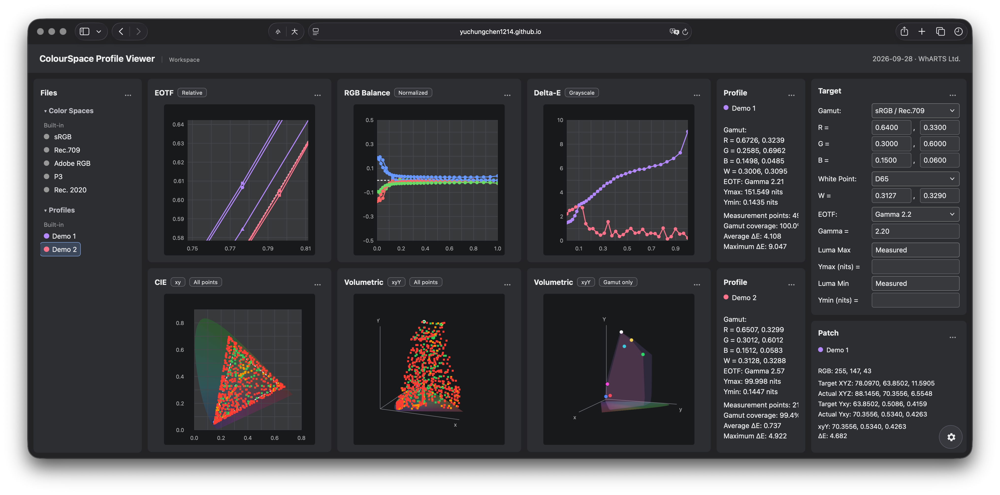

# ColourSpace Profile Viewer

A convenient, easy-to-use browser tool for observing and presenting multiple display-measurement profiles side by side or overlaid on shared charts, using ColourSpace `.bcs` files.

## Preview



## Features

- EOTF, RGB Balance, CIE xy/uv, Volumetric xyY/uvY, and Delta-E charts
- Easily compare or present multiple profiles side by side or overlaid on the same charts
- Configure target gamut, white point, EOTF, and luminance range
- Inspect measured patches, add notes, and customize profile colors
- Export settings, complete viewer data, or a self-contained HTML report
- Built-in **Demo 1** and **Demo 2** profiles

## Download

Download the latest source from this repository using **Code > Download ZIP**. No separate desktop installer is required.

## Use Online

Open the [ColourSpace Profile Viewer](https://yuchungchen1214.github.io/colourspace-profile-viewer/) in your browser. No download or installation is required.

## Applications

ColourSpace Profile Viewer runs in a modern web browser on macOS, Windows, and Linux. Open `index.html` to get started.

## Documentation

Drag `.bcs` files or folders into the **Files** panel. Use the chart controls to switch views, and the Target panel to set the comparison reference. Built-in demo profiles are available for a quick preview without importing files.

If your browser restricts features when opening local files directly, start a local server from the project folder:

```sh
python3 -m http.server 8000
```

Then open <http://localhost:8000>.

No package installation or runtime dependencies are required. Node.js is only needed to refresh the embedded report runtime or run the project checks.

## Notes

- Imported bcs files are read and processed locally in your browser; the app does not upload them.
- Self-contained HTML reports include their report data and viewer code. Share them only with people who should have access to the included measurements.
- Charts are for viewing and comparison; they do not perform display calibration. CIE spectral backgrounds are visual references, and displayed colors are screen approximations.
- The public source package contains only the latest release. Personal measurements, exported reports, backups, and historical snapshots are excluded.

## Credits

This independent project was inspired by Light Illusion's ColourSpace and Rational Acoustics' Smaart. It is not affiliated with, endorsed by, or sponsored by either company. All trademarks are the property of their respective owners and are used only to identify their products.

## License

Copyright © 2026 WhARTS Ltd. All rights reserved. This is source-available software, not an open-source release. Viewing and personal, non-commercial use are permitted under the terms in [LICENSE](LICENSE). Modification, derivative works, redistribution, sublicensing, or commercial use require prior written permission.
